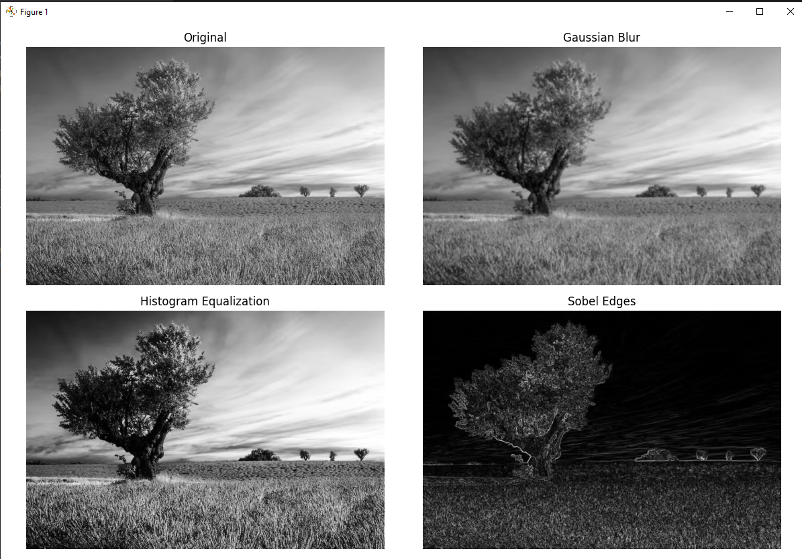

# MiniCV - Image Processing Library (From Scratch)

A lightweight Python image processing library built from scratch using only NumPy and Matplotlib.
This project emulates a subset of OpenCV functionality as part of a Machine Vision course.

---

## 📌 Features

### 🧱 Core Utilities

* Image normalization (multiple modes)
* Pixel clipping
* Image padding (constant, reflect, edge)

### 🔥 Filtering

* 2D Convolution (implemented from scratch)
* Mean (Box) Filter
* Gaussian Filter (custom kernel generation)
* Median Filter
* Sobel Edge Detection

### 🖼️ Image Processing

* Global Thresholding
* Otsu Thresholding
* Adaptive Thresholding
* Histogram Computation
* Histogram Equalization
* Bit-plane Slicing

### 🔄 Transformations

* Resize (Nearest Neighbor & Bilinear)
* Rotation
* Translation

### 🎯 Feature Extraction

* Histogram-based features
* Sobel-based gradient features

### ✏️ Drawing

* Draw points
* Draw lines
* Draw rectangles
* Draw polygons

---

## ⚙️ Installation

1. Clone the repository:

```bash
git clone <your-repo-link>
cd minicv_project
```

2. Create virtual environment:

```bash
python -m venv venv
venv\Scripts\activate   # Windows
```

3. Install dependencies:

```bash
pip install -r requirements.txt
```

---

## 🚀 Usage Example

```python
from minicv.io import read_image
from minicv.filters import gaussian_filter
import matplotlib.pyplot as plt

img = read_image("images/test.jpg", as_gray=True)
blur = gaussian_filter(img, 5, 1.0)

plt.imshow(blur, cmap='gray')
plt.title("Gaussian Blur")
plt.show()
```

---

## 🧪 Running Tests

```bash
python -m tests.test_milestone1
```

---

## 📁 Project Structure

```
minicv_project/
│
├── minicv/        # Main library
├── tests/         # Unit tests
├── examples/      # Demo scripts
├── images/        # Sample images
├── main.py
├── requirements.txt
└── README.md
```

---

## 📊 Example Results

| Original    | Gaussian Blur | Sobel Edges |
| ----------- | ------------- | ----------- |
| (add image) | (add image)   | (add image) |

---

## 🧠 Implementation Notes

* All algorithms are implemented from scratch using NumPy
* No external image processing libraries were used (e.g., OpenCV)
* Emphasis on vectorized operations for performance
* Modular and maintainable code structure

---

## 🎓 Course Information

* Course: Machine Vision (CSE480)
* Faculty of Engineering - Ain Shams University
* Milestone 1: Custom Image Processing Library

---

## 🚀 Future Work

* Complete Machine Vision Pipeline (Milestone 2)
* Feature selection (MRMR)
* ML models (KNN, Softmax, CNN)

---

## result 


---


## 👨‍💻 Author

* Mohamed Ahmed , Asem Mohamed , Youssef Ezz

---

## ⭐ Notes

This project is designed for educational purposes and demonstrates fundamental image processing techniques without relying on external libraries.
